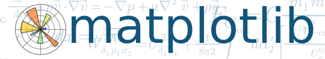

% Scientific Analysis with ArcGIS and SciPy
% Shaun Walbridge; Kevin Butler

<section data-background="images/title.jpg">
<h2>[https://github.com/esrioceans/oceans-workshop-2016](https://github.com/esrioceans/oceans-workshop-2016)</h2>
<h3>[High Quality PDF](https://4326.us/esri/scipy-ws/oceans-forum-2016-scipy-workshop-presentation-full.pdf)</h3>
<h3>[Resources](https://4326.us/esri/scipy/#resources)</h3>
</section>

Scientific Computing {data-background="images/title.jpg"}
====================

Scientific Computing {data-background="images/title.jpg"}
--------------------

> Computers are now essential in all branches of science, but most researchers are never taught the equivalent of basic lab skills for research computing.

[Good Enough Practices in Scientific Computing](https://arxiv.org/pdf/1609.00037v2.pdf)

Learn to take advantage of your #1 collaborator &mdash;

. . .

your future self. 

> "Your self from 3 months ago doesn't answer email"

Python {data-background="images/Picture2.jpg"}
======

Why Python? {class="tight"} {data-background="images/Picture2.jpg"}
-----------

 - Accessible for new-comers, and the [most taught first language in US universites](http://cacm.acm.org/blogs/blog-cacm/176450-python-is-now-the-most-popular-introductory-teaching-language-at-top-us-universities/fulltext)
 - Extensive package collection (56k on [PyPI](https://pypi.python.org/pypi)), broad user-base
 - Strong glue language used to bind together many environments, both open source and commercial

. . . 

<br>

* Brand new to Python? Will walk you through all examples, show tools which use it.
* Resources include materials that for getting started, [75 minute DevSummit session](http://www.esri.com/videos/watch?videoid=4419&channelid=LegacyVideo&isLegacy=true&title=Python:%20Working%20with%20Scientific%20Data)

Python in ArcGIS {data-background="images/Picture2.jpg"}
----------------

 * Here, focus on SciPy stack, what’s included out of the box
 * Move toward maintainable, reusable code and beyond the “one-off”
 * Recurring theme: multi-dimensional data structures

<div class="notes">

Multi-dimensional data structures -- numpy, pandas, our multi-d support all take advantage of different forms of an N-dimensional data structure. Rich, lets you pack simpler data into it for performance, still useful for 1D and 2D data!

Both also available online after the conference videos are posted to video.esri.com.
</div>


SciPy  {data-background="images/Picture4.jpg"}
=====

Why SciPy? {data-background="images/Picture4.jpg"}
----------

* Most languages don’t support things useful for science, e.g.:
    + Vector primitives
    + Complex numbers
    + Statistics
* Object oriented programming isn’t always the right paradigm for 
   analysis applications, but is the only way to go in many modern languages
* SciPy brings the pieces that matter for scientific problems to Python.

Included SciPy {data-background="images/Picture4.jpg"}
--------------

Package                                               KLOC     Contributors      Stars
-------                                             ------   --------------    -------
[matplotlib](http://matplotlib.org/)                   121              439       4282
[Nose](http://readthedocs.org/docs/nose/en/latest/)      7               76       1014
[NumPy](http://www.numpy.org/)                         248              430       3502
[Pandas](http://pandas.pydata.org)                     222              410       7342
[SciPy](http://scipy.org/scipylib/)                    314              423       2670
[SymPy](http://sympy.org/)                             262              449       3280
Totals                                                1174             1879

 {data-background="images/Picture4.jpg"}
---------------------------

  1. An array object of arbitrary homogeneous items
  2. Fast mathematical operations over arrays
  3. Random Number Generation


[SciPy Lectures](https://scipy-lectures.github.io/intro/numpy/array_object.html#indexing-and-slicing), CC-BY

ArcGIS + NumPy {data-background="images/Picture4.jpg"}
--------------
 - ArcGIS and NumPy can interoperate on raster, table, and feature data.
 - See [Working with NumPy in ArcGIS](http://desktop.arcgis.com/en/desktop/latest/analyze/python/working-with-numpy-in-arcgis.htm)
 - In-memory data model. Can process by blocks for larger datasets.

ArcGIS + NumPy {data-background="images/Picture4.jpg"}
--------------


 
 {data-background="images/Picture4.jpg"}
--------------------------------

 - Plotting library and API for NumPy data
 - [Matplotlib Gallery](http://matplotlib.org/gallery.html)


 {data-background="images/Picture4.jpg"}
---------------------------

Computational methods for:

 - Integration ([scipy.integrate](http://docs.scipy.org/doc/scipy/reference/tutorial/integrate.html))
 - Optimization ([scipy.optimize](http://docs.scipy.org/doc/scipy/reference/tutorial/optimize.html))
 - Interpolation ([scipy.interpolate](http://docs.scipy.org/doc/scipy/reference/tutorial/interpolate.html))
 - Fourier Transforms ([scipy.fftpack](http://docs.scipy.org/doc/scipy/reference/tutorial/fftpack.html))
 - Signal Processing ([scipy.signal](http://docs.scipy.org/doc/scipy/reference/tutorial/signal.html))
 - Linear Algebra ([scipy.linalg](http://docs.scipy.org/doc/scipy/reference/tutorial/linalg.html))
 - Spatial ([scipy.spatial](http://docs.scipy.org/doc/scipy/reference/tutorial/spatial.html))
 - **Statistics** ([scipy.stats](http://docs.scipy.org/doc/scipy/reference/tutorial/integrate.html))
 - **Multidimensional image processing** ([scipy.ndimage](http://docs.scipy.org/doc/scipy/reference/tutorial/ndimage.html))

<div class="notes">
Spatial is the tools across all of the domains of science, very general.

That said, can be useful in a variety of circumstances, e.g. `KDTree` for finding data quickly.
</div>

SciPy: Geometric Mean {data-background="images/Picture4.jpg"}
---------------------

 - Calculating a geometric mean of an _entire raster_ using SciPy ([source](https://github.com/EsriOceans/oceans-workshop-2016/blob/master/scipy/demos/geometric-mean.py))


```python
import scipy.stats  
rast_in = 'data/input_raster.tif'
rast_as_numpy_array = arcpy.RasterToNumPyArray(rast_in)
raster_geometric_mean = scipy.stats.stats.gmean(
    rast_as_numpy_array, axis=None)  
```

<div class="notes">
([Inspiration](https://geonet.esri.com/message/436296#436296))
</div>

Use Case: Benthic Terrain Modeler {data-background="images/btm-terrain.jpg"}
--------------------------------

Benthic Terrain Modeler {data-background="images/Picture2.jpg"}
-----------------------

 - A Python Add-in and Python toolbox for geomorphology
 - Open source, can borrow code for your own projects:
   [https://github.com/EsriOceans/btm](https://github.com/EsriOceans/btm)
 - Active community of users, primarily marine scientists, but also useful for other applications 
 - Used in exercises


SciPy Statistics {data-background="images/Picture2.jpg"}
----------------


 - Break down aspect into `sin()` and `cos()` variables
 - Aspect is a circular variable &mdash; without this 0 and 360 are opposites instead of being the same value

SciPy Statistics {data-background="images/Picture2.jpg"}
----------------

Summary statistics from SciPy include circular statistics ([Source](https://github.com/EsriOceans/oceans-workshop-2016/blob/master/scipy/demos/circular-stats.py))

```python
import scipy.stats.morestats

ras = "data/aspect_raster.tif"
r = arcpy.RasterToNumPyArray(ras)

morestats.circmean(r)
morestats.circstd(r)
morestats.circvar(r)
```

Pandas {data-background="images/Picture4.jpg"}
======

 {data-background="images/Picture4.jpg"}
----------------------------
 - **Pan**el **Da**ta &mdash; like R "data frames"
 - Bring a robust data _analysis_ workflow to Python
 - Data frames are fundamental &mdash; treat tabular (and multi-dimensional)
   data as a labeled, indexed series of observations.

 {data-background="images/Picture4.jpg"}
----------------------------

([Source](https://github.com/EsriOceans/oceans-workshop-2016/blob/master/scipy/demos/pandas-filter.py)
```python
import pandas

data = pandas.read_csv('data/season-ratings.csv')
data.columns
```
```python
Index([u'season', u'households', u'rank', 
       u'tv_households', u'net_indep', 
       u'primetime_pct'], dtype='object')
```

 {data-background="images/Picture4.jpg"}
----------------------------

```python
majority_simpsons = data[data.primetime_pct > 50]
```
        season households  tv_households  net_indep  primetime_pct
    0        1  13.4m[41]           92.1       51.6      80.751174
    1        2  12.2m[n2]           92.1       50.4      78.504673
    2        3  12.0m[n3]           92.1       48.4      76.582278
    3        4  12.1m[48]           93.1       46.2      72.755906
    4        5  10.5m[n4]           93.1       46.5      72.093023
    5        6   9.0m[50]           95.4       46.1      71.032357
    6        7   8.0m[51]           95.9       46.6      70.713202
    7        8   8.6m[52]           97.0       44.2      67.584098
    8        9   9.1m[53]           98.0       42.3      64.383562
    9       10   7.9m[54]           99.4       39.9      60.916031
    10      11   8.2m[55]          100.8       38.1      57.466063
    11      12  14.7m[56]          102.2       36.8      53.958944
    12      13  12.4m[57]          105.5       35.0      51.094891

Where and How Fast? {data-background="images/Picture4.jpg"}
===================

Where Can I Run This? {data-background="images/Picture4.jpg"}
---------------------
 * Now: 
    - ArcGIS Pro (64-bit) [Standalone Python Install for Pro](http://pro.arcgis.com/en/pro-app/arcpy/get-started/installing-python-for-arcgis-pro.htm)
    - ArcGIS Desktop at 10.4: 32-bit, Background Geoprocessing (64-bit), Server (64-bit), Engine (32-bit)
        + Both now ship with [Scipy Stack](https://www.scipy.org/about.html) (sans IPython)
    - MKL enabled NumPy and SciPy everywhere
    - <span style="font-size: 0.6em;">Older releases: NumPy: ArcGIS 9.2+, matplotlib: ArcGIS 10.1+, SciPy: 10.4+, Pandas: 10.4+</span>

<div class="notes">
    - SciPy stack is now available across the platform. Try it out, you can build things that will work on your machine and your users machines without additional work.
</div>

How Does It perform? {data-background="images/Picture4.jpg"}
--------------------

 * Built with Intel’s [Math Kernel Library (MKL)](https://software.intel.com/en-us/intel-mkl) and compilers&mdash;highly optimized Fortran and C under the hood. 
 * Automated parallelization for executed code

[MKL Performance Chart](https://4326.us/esri/scipy/mkl-perf)

<div class="notes">
Quoting Kevin from last year: Wicked fast. Pandas is fast, scipy functions are fast, and we now enable MKL across the platform for all builds. You write Python, but get best of class performance for free.

Take this graph with a large grain of salt. Realistically, can expect 2-10x improvements in many numerical routines.
</div>

SciPy Hands-on Activity {data-background="images/Picture4.jpg"}
=======================

SciPy Hands-on Activity {data-background="images/Picture4.jpg"}
-----------------------

[SciPy Exercise](https://github.com/esrioceans/oceans-workshop-2016/tree/master/scipy/exercise)
